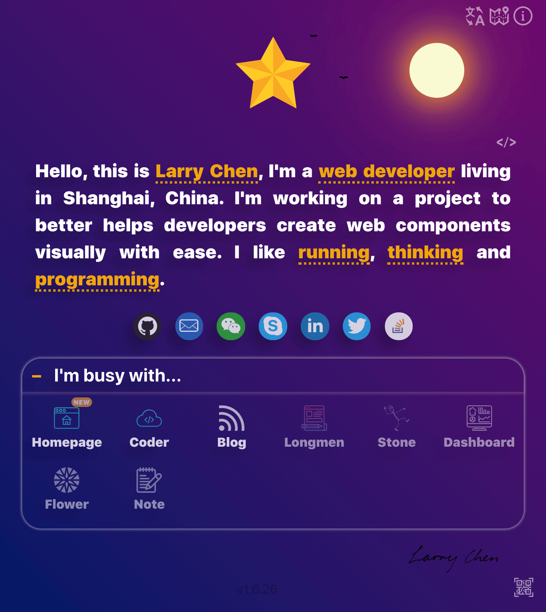
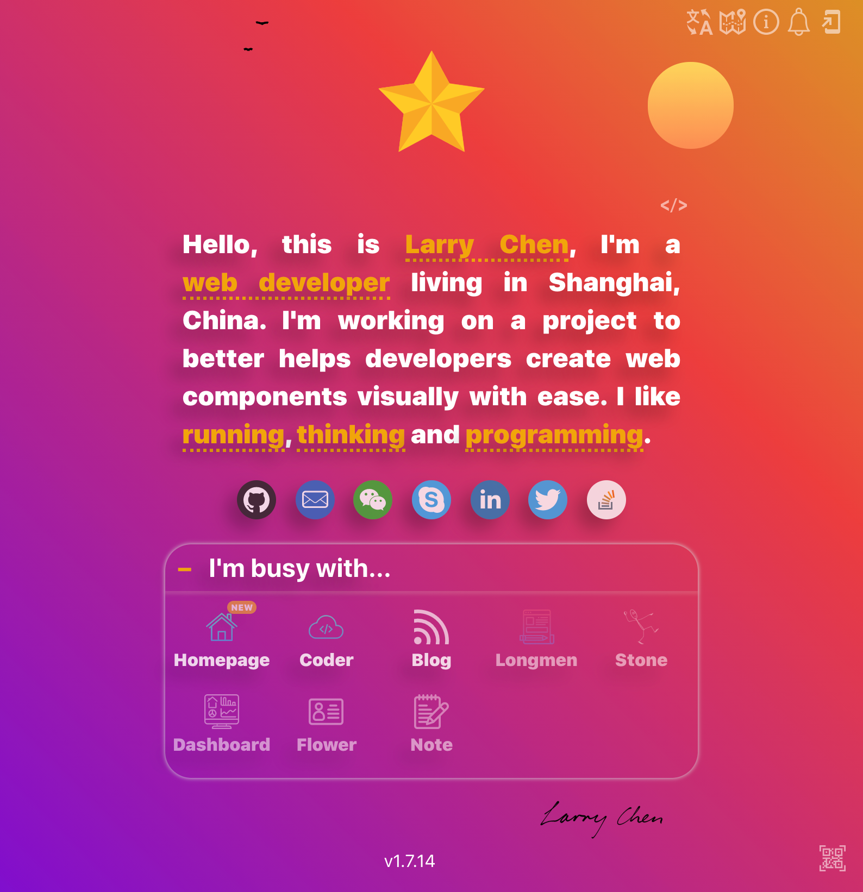

[](https://chendachao.github.io/)
[](https://app.netlify.com/sites/chendachao/deploys)
[](https://standardjs.com)
[](https://validator.nu/?doc=https%3A%2F%2Fchendachao.github.io%2F)

> The above badges are generated by https://shields.io/

## Websites
- [Github pages](https://chendachao.github.io/)
- [Netlify](https://chendachao.netlify.app/)
- [Vercel](https://chendachao-github-io.chendachao.vercel.app/)

## Screenshots



## Performance
- [Performance](https://developers.google.com/web/fundamentals/performance/why-performance-matters)
- [Website Optimization Tools](https://www.crazyegg.com/blog/website-optimization-tools/)
- [Website Speed Test](https://webspeedtest.cloudinary.com/)
- [PageSpeed Insights](https://developers.google.com/speed/pagespeed/insights/)
- [Webpage Test](https://www.webpagetest.org/)
- [Google Search Console](https://search.google.com/search-console)
- [GTmetrix](https://gtmetrix.com)
- [Image Compressor](https://imagecompressor.com/)
- [Smart PNG and JPEG compression](https://tinypng.com/)
- [SVG Compressor](https://jakearchibald.github.io/svgomg/)
- [Convert Font to SVG](https://onlinefontconverter.com/)
- [Pixel Perfect Icon Solutions && Custom Font](https://icomoon.io/)
- [SVG Sprit](https://svgsprit.es/) - has some issues, be caution with it.
- [Hotjar](https://insights.hotjar.com/sites/1939682/dashboard)
- [emoji](http://xahlee.info/comp/unicode_arrows.html)

## TODOs:
- ✅ JSON description for developer view
- [ ] More social icons
- [ ] Share on Wechat, QQ, twitter and so on.
- [ ] Show rainbow sometimes.
- [ ] FM/Music section.
- ✅ My projects section.
- ✅ Intro for all sections.
- ✅ Change them to gray on specific day.
- ✅ [PWA] Update event subscribe with push/notifications API, recommend a 'Subscribe Up✅e' button
- ✅ [PWA] Update alert

## PWA Debug:
1. Run command `yarn build:w`.
2. Install `http-server` globally and run command `http-server dist -c-1` in root directory.
3. Make some changes, then refresh the page

## References
- https://web.dev/tags/performance/
- https://formito.com/tools/favicon
- https://simpleicons.org/
- https://www.cssscript.com/customizable-interactive-tooltips-pure-javascript-tippy-js/
- https://codepen.io/Metty/pen/KrvLQx
- https://codepen.io/Stockin/pen/jeNQEN
- https://www.flaticon.com/
- https://cssgradient.io/
- https://coolors.co/gradient-maker/f8dadc-b6edc8-eeacdc
- https://www.checkmycolours.com/
- https://kazuhikoarase.github.io/qrcode-generator/js/demo/
- https://iconmonstr.com/
- https://validator.nu/
- https://mailto.now.sh/
- https://vercel.com/
- https://myraah.io/index.php/visualmind
- https://thomaspark.co/projects/fontcdn/
- https://glyphsearch.com/
- https://editor.method.ac/
- https://svg-edit.github.io/svgedit/dist/editor/index.html
- https://yqnn.github.io/svg-path-editor/
- https://vectr.com/
- https://www.calligrapher.ai/
- http://patorjk.com/text-color-fader/
- [Log tracing](https://sentry.io/)
- [Favicon checker and generator](https://realfavicongenerator.net/)
- [PWA Builder](https://www.pwabuilder.com/)
- [Web Share](https://web.dev/web-share/)


PS:
  - [JSON description](https://chendachao.github.io/assets/data/en/chendachao.json)
  - [JSON description Local](http://localhost:8088/assets/data/en/chendachao.json)

Push with `yarn deploy:patch` not ps

## Commit Message
type must be one of [build, chore, ci, docs, feat, fix, perf, refactor, revert, style, test] [type-enum]
```
type(scope?): subject
body?
footer?
```

## Branches
`dev -> main -> gh-pages`
